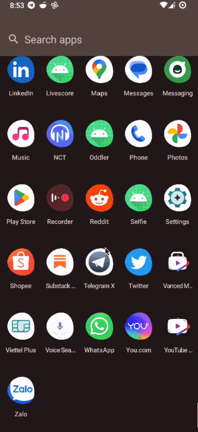

## Table of Contents

- [Introduction](#introduction)
- [Features](#features)
- [Architecture](#architecture)
- [Demo](#demo)

## Introduction
- Demonstration application for Selfie

## Features

List of features that build in this app

* Login/Logout
* Show selfie photos in home
* Selfie

## Architecture

* Clean architecture with MVVM model
* UI layer -> Data layer[Repository -> [RemoteSource, LocalSource]]

## Tech-Stack
* Kotlin Coroutine, Flow -> async programming
* Jetpack Navigation -> single activity
* Koin -> dependencies injection
* Kotlin-Serialization -> json serialize
* Ktor -> network
* Coil -> image load

## Demo

